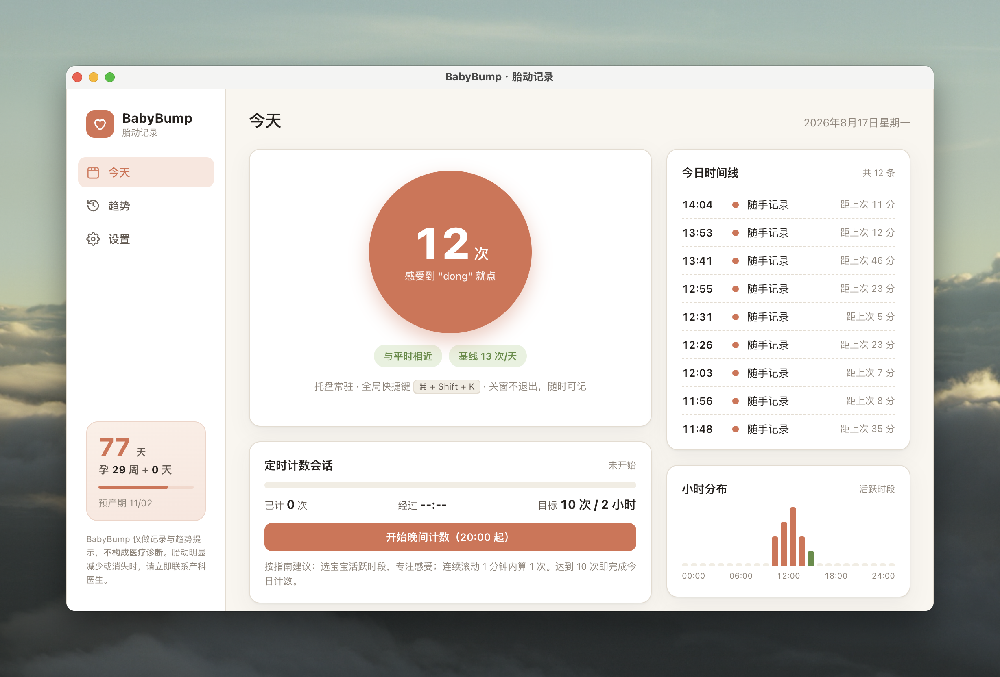
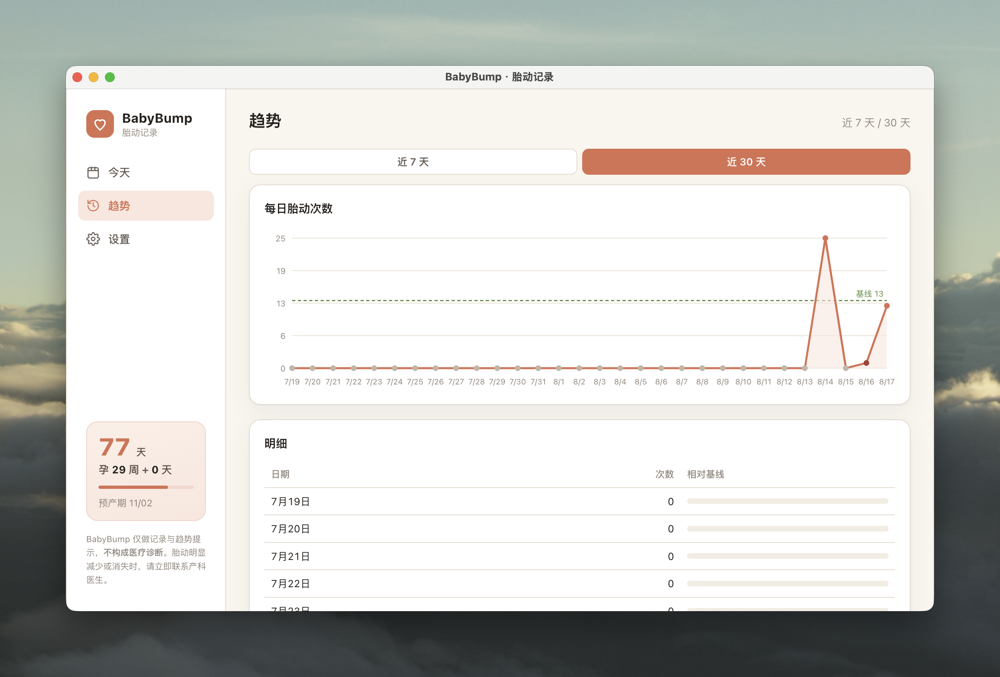

# BabyBump

> 桌面端胎动记录轻应用
>
> 感受到胎动时点一下，轻松留下记录；通过每日汇总与个人基线对比，帮助了解宝宝平时的活动模式。

## 界面预览

| 今日记录 | 趋势分析 |
| --- | --- |
|  |  |

<p align="center">
  
</p>
<p align="center">迷你模式：桌面常驻、点击记录，支持拖拽与快速切回完整版。</p>

> 截图中的记录与孕期信息仅用于界面演示；实际使用时，请妥善保管个人健康数据。

## 产品定位

BabyBump 是一款面向孕期用户的本地桌面应用，重点解决电脑工作或居家办公时“不方便拿手机记录胎动”的问题。

核心理念是：

> **不追求统一的胎动次数标准，而是关注宝宝自己的日常模式。**

应用提供低摩擦的一键记录、定时计数、趋势查看和异常模式提示，但**不提供医疗诊断**。如果胎动明显减少、消失，或与平时模式明显不同，请立即联系产科医生或助产士。

## 功能

### 一键记录

- 点击主界面中央按钮记录一次胎动
- 支持应用内 `Space` 快捷键
- 支持系统托盘菜单记录
- 支持全局快捷键，在其他应用中也可以记录
- 每条记录自动保存时间戳和来源

### 自动合并连续胎动

默认情况下，连续 1 分钟内的多次点击会合并为 1 次有效胎动，符合常见胎动计数规则。

合并时间可以在“设置 → 记录”中调整，也可以关闭合并规则。

### 完整版与迷你模式

- **完整版**：查看今日汇总、时间线、小时分布和基线对比
- **迷你模式**：置顶悬浮圆窗，点击即可记录
- 两种模式互斥切换
- 迷你窗支持拖拽，并会记住上次位置
- 关闭主窗口不会退出应用，而是切换到迷你模式

### 定时计数会话

可以在宝宝通常比较活跃的时间段开始一次计数会话：

- 显示会话已记录次数
- 显示已用时间
- 支持自定义目标次数，默认 10 次
- 达到目标后给出完成提示
- 记录会标记为“会话”来源

### 今日汇总

- 今日有效胎动次数
- 今日胎动时间线
- 相邻记录的时间间隔
- 按小时查看活动分布
- 当前孕周与距离预产期天数（填写预产期后显示）

### 个人基线与趋势

- 使用最近 7 天有记录日期的中位数建立个人基线
- 对比今日记录与个人历史模式
- 支持查看近 7 天或近 30 天趋势
- 当今日次数低于基线 50% 时显示关注提示

> 基线只用于观察相对变化，不代表医学上的“正常值”或“异常诊断”。

### 提醒与数据导出

- 每日计数提醒时间可配置
- 可开启或关闭异常模式提醒
- 支持将胎动记录导出为 CSV，便于产检时查看或提供给医生

## 技术栈

- [Electron](https://www.electronjs.org/)
- HTML / CSS / JavaScript
- Electron 主进程与渲染进程通过 `preload.js` 安全桥接
- 本地 JSON 文件持久化
- `contextIsolation: true`
- `nodeIntegration: false`

当前项目为本地桌面应用，不依赖账号、云端服务或后端接口。

## 项目结构

```text
BabyBump/
├── app/
│   ├── main.js              # Electron 主进程：窗口、托盘、快捷键、持久化、IPC
│   ├── preload.js           # contextBridge 安全桥接
│   ├── package.json         # 应用依赖与启动脚本
│   ├── package-lock.json
│   ├── assets/
│   │   ├── icon.png         # 应用图标
│   │   └── trayTemplate.png  # macOS 托盘图标
│   └── renderer/
│       ├── index.html       # 完整版界面及交互逻辑
│       └── mini.html        # 迷你悬浮窗
├── prototype/
│   ├── icon.png
│   └── trayTemplate.png
├── BabyBump-Prototype.html  # 早期交互原型
└── 产品需求调研报告.md       # 产品背景、医学边界与需求调研
```

## 开发环境

- Node.js
- npm
- macOS（当前主要开发与验证平台）
- Electron `^33.0.0`

## 安装与运行

进入应用目录：

```bash
cd app
```

安装依赖：

```bash
npm install
```

启动开发版本：

```bash
npm start
```

也可以直接使用 Electron 启动：

```bash
npx electron .
```

## 调试

如果需要通过 Chrome DevTools Protocol 调试 Electron 页面，可以在启动前指定调试端口：

```bash
BB_DEBUG_PORT=9339 npx electron .
```

请使用本机未被其他程序占用的端口。

## 数据存储

应用使用 Electron 的 `userData` 目录保存本地数据，文件名为：

```text
babybump-data.json
```

数据结构大致如下：

```json
{
  "records": [
    {
      "id": 1720000000000.123,
      "ts": 1720000000000,
      "weight": 1,
      "src": "manual"
    }
  ],
  "settings": {
    "dueDate": "2026-12-01",
    "shortcut": "space",
    "mergeSec": 60,
    "goal": "10",
    "remind": true,
    "anomaly": true
  }
}
```

`weight` 为 `0` 的记录表示在合并时间窗口内的连续点击，不计入有效次数，但仍保留原始点击时间。

常见 `src` 来源包括：

- `manual`：完整版手动点击
- `session`：定时计数会话中的点击
- `tray`：托盘或全局快捷键触发
- `mini`：迷你悬浮窗触发

数据默认只保存在本机。删除应用或清理应用数据前，请先导出 CSV 或备份 JSON 文件。

## 快捷键与托盘

默认快捷键为应用内 `Space`。在设置中还可以选择：

- `Space`：仅在应用内生效
- `⌘ + K`：macOS 全局快捷键
- `Ctrl + Shift + K`：跨平台全局快捷键

应用启动后会常驻系统托盘：

- 切换完整版 / 迷你模式
- 记录一次胎动
- 开始晚间计数
- 打开提醒设置
- 退出 BabyBump

## 手机端 PWA 与局域网同步

当前版本提供一个轻量手机端 PWA，适合周末或离开电脑时快速记录胎动。

### 使用方式

1. 启动 BabyBump 桌面端。
2. 确认手机与电脑连接同一个 Wi‑Fi。
3. 在桌面端进入“设置 → 手机端 → 显示地址”。
4. 将显示的地址复制到手机浏览器打开。
5. 按手机浏览器提示添加到主屏幕，即可像 App 一样使用。

手机端支持：

- 一键记录胎动
- 本地离线保存
- 1 分钟内连续胎动自动合并
- 今日次数和时间线
- 手动同步到桌面端
- 桌面端记录与手机端记录按记录 ID 合并，避免重复

同步服务只在桌面端运行期间可用，默认监听局域网端口 `18765`。配对地址中包含随机令牌，不要分享给其他人。手机和电脑不在同一网络时，手机仍可本地记录，恢复同一 Wi‑Fi 后点击“立即同步”即可上传。

### 同步边界

- 桌面端保留窗口位置、模式和同步令牌等本地设置，不接受手机端覆盖。
- 胎动记录按唯一 `id` 合并，不通过整份 JSON 覆盖数据。
- PWA 使用 `localStorage` 保存离线数据，并通过 Service Worker 缓存页面资源。
- 当前同步是局域网方案，不包含云端同步、账号体系或公网访问。


### 医疗边界

BabyBump 仅用于记录个人感受、整理历史趋势和提示可能的模式变化：

- 不是医疗器械
- 不进行胎心监测
- 不替代产检、医生判断或急救服务
- 不应根据应用结果自行排除风险

如果胎动明显减少、消失，或与平时模式显著不同，请不要等待应用给出更多数据，及时联系产科医生或前往医疗机构。

### 隐私

- 胎动记录默认保存在本机
- 不要求注册账号
- 不包含云同步和远程上传功能
- 导出文件由用户主动生成和管理

## 当前限制

- 当前主要面向 macOS 开发和验证
- 每次启动只维护一个应用实例
- 提醒能力依赖应用进程处于运行状态
- 基线目前按最近 7 天有记录日期的有效次数建立
- 医学提示是产品规则提示，不构成诊断结论
- 暂不支持多胎分别记录、云同步和移动端同步

## 验证

修改代码后，可以先进行不启动 GUI 的静态检查：

```bash
cd app
node --check main.js
node --check preload.js
python3 -m json.tool package.json >/dev/null
```

如需验证渲染层逻辑，建议在确认不会影响当前工作环境后，再启动 Electron 进行一次完整交互检查。

## License

[MIT](LICENSE)

> 如果项目根目录尚未提供独立的 `LICENSE` 文件，请在发布前补充与项目实际授权方式一致的许可证文件。
